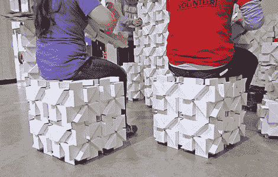
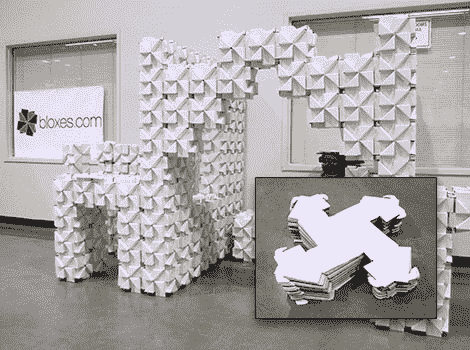

# bamf 2011:blox，一个有着漂亮血统的构建套件

> 原文：<https://hackaday.com/2011/05/21/bamf2011-bloxes-a-building-kit-with-a-nifty-pedigree/>

并不是每一个很酷的技术都需要用到微控制器、发光二极管或其他闪亮的东西。我们最初被[blox](http://bloxes.com/)展示所吸引，只是因为我们喜欢好的多用途建筑组合，无论是[乐高](http://hackaday.com/2011/05/18/lego-technic-super-8-movie-projector/)、 [80/20 铝](http://hackaday.com/2008/07/13/fabr-another-3d-printing-project/)，还是在这种情况下，由六块相同的瓦楞纸板组成的联锁立方体系统，切割和刻痕的方式形成了一个惊人坚固的小积木。它们可以变成简单的家具，时髦的洛根风格的房间装饰，或者非常重要的儿童堡垒……然后再拆卸，做成别的东西。

一个优雅的概念在最简陋的材料上实现…我们已经被迷住了。当得知布洛克斯的背景时，我们大吃一惊:他们是计算机先驱[[杰夫·拉斯金](http://en.wikipedia.org/wiki/Jef_Raskin)]上世纪 70 年代的发明，或许最出名的是“T2 麦金塔之父”[Raskin]的儿子和女儿[Aza]和[Aviva]在 2008 年重新提出了 Bloxes 的概念，现在通过他们的[网站](https://bloxes.myshopify.com/products/bloxes)销售套件。即使你不在展会上，他们也欢迎读者使用折扣代码 MAKERFAIRE2011(有效期至 2011 年 6 月 12 日，每人限买一个)，这将为你带来一套五个积木(30 个，需要一些组装)，价格为 12.63 美元，而正常价格为 15.59 美元。