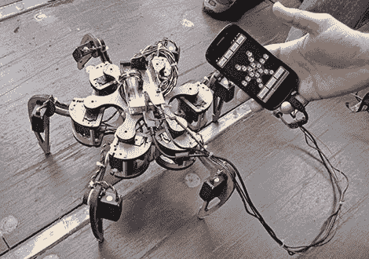

# BAMF2011:谷歌的 SKPR 机器人，不适合蜘蛛恐惧症患者

> 原文：<https://hackaday.com/2011/05/23/bamf2011-google%e2%80%99s-skpr-bot-not-for-arachnophobes/>

谷歌的 Maker Faire 展览空间挤满了机器人……呃，机器人。在一些很酷的两足动物和赛格威平衡器中，我们内心的科幻书呆子对这个六足动物设计最着迷，他们称之为 [SKPR 机器人](http://goo.gl/skprbot)。“Skipper”展示了各种谷歌技术的易用性: [SketchUp](http://hackaday.com/2008/11/17/sketchup-adds-dynamic-components/) 、 [Android OS](http://hackaday.com/2010/07/12/android-development-101-–-a-tutorial-series/) 和 [Android 开放附件开发套件](http://hackaday.com/2011/05/11/official-android-open-accessory-development-kit-its-an-arduino/)。整个项目不到六周就完成了。

18 个[伺服系统](http://hackaday.com/2011/01/28/the-openservo-project/)安装在 SketchUp 设计的框架上，由[波诺科](http://hackaday.com/2008/12/01/ponoko-launches-subscription-manufacturing/)激光切割。低级伺服 PWM 控制由开发套件处理(正如我们所见，本质上是一个重新标记的 Arduino Mega)，而 Android OS 手机提供了一个光滑的 GUI，并处理机器人每走一步所需的所有逆[运动学](http://hackaday.com/2010/04/27/apod-an-update/)计算。最酷的一点是，这一切都是公开的。现在，你必须在网上搜寻一些计划和代码，但是过一段时间后，他们计划在 SKPR 机器人网站上把所有的东西放在一起。