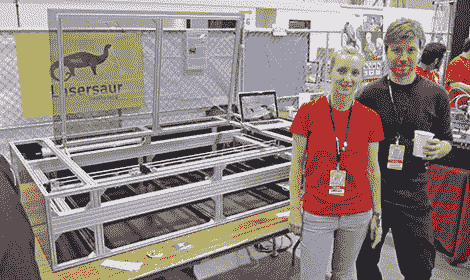
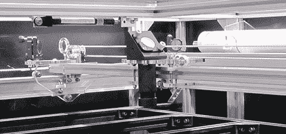

# BAMF2011: Lasersaur 是一款大型激光切割机！

> 原文：<https://hackaday.com/2011/05/22/bamf2011-lasersaur-is-one-big-laser-cutter/>

嘶…想买激光切割机，但不准备卖你的内脏？Nortd Labs 的 [Lasersaur](http://www.lasersaur.com/) 项目旨在创建一个开源的大幅面[激光切割机/雕刻机](http://hackaday.com/2011/03/11/bench-top-laser-engraver-does-some-cutting-too/)来削弱( *har har！*)商用机型成本一个数量级。

严格使用全球可用的材料清单中的组件建造的激光雷达将花费你大约 5000 美元。但是，如果你能在当地采购一些零件……或者更好的是，如果你有乞讨的诀窍(例如，步进电机在废弃的 T2 喷墨打印机中很常见)……它可能会便宜一千或更多。对于孤独的车库修理工来说，这仍然是一个很大的变化……但对于学校或[黑客空间](http://hackaday.com/2011/03/10/hackerspace-camera-rig-auto-alerts-the-internets-when-projects-are-finished/)，或者任何能够汇集一些劳动力和资金的人来说，这可能会使激光工作更加实用。入门级的商业模型可以以类似的价格购买，但相比之下这些都很小——laser saur 的切割床是一个巨大的 140×72 厘米！

除了降低成本，该项目的另一个目标是打破大多数商业激光平台的 Windows/Corel 霸权。Lasersaur 的“大脑”是基于 Arduino 的，本质上是跨平台的。硬件通过定制的电机控制屏蔽接口，易于与所有通孔元件组装。

Lasersaur 项目目前处于封闭的 alpha 阶段，目标是在今年夏天发布一个完整的 1.0 开源版本。如果你渴望成功，项目贡献者可以提前获得设计文档和软件。