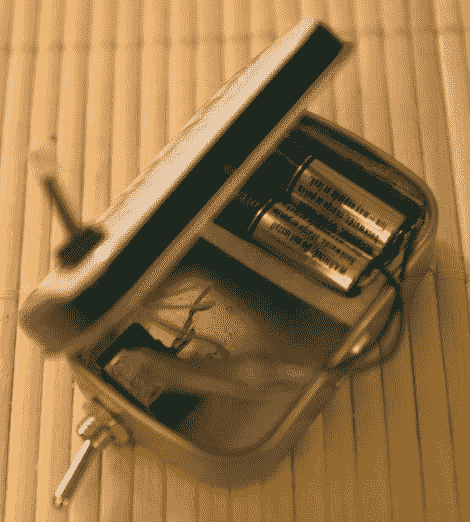

# 电池座重复使用泡罩包装

> 原文：<https://hackaday.com/2010/02/04/battery-holder-reuses-blister-pack/>

在需要便携式电源的时候，[Alastair] [把一些电池扔进了一个 Altoids 罐](http://bitxdeadweight.blogspot.com/2010/01/ring-light-portable-power.html)。问题是他没有这些 A23 号电池的支架。灵感来了，他意识到他们进来的泡罩包装非常适合他们，只需要一些导体来完成电路。他从一台坏掉的激光唱机上取下一些电池触点。他使用基于泡沫的双面胶带，给触点增加了一些弹性，并制作出了一个大小完美的支架，效果非常好。

我们试着用胶带把整个东西包起来做成电池组。这看起来工作得更好，并且在这个[薄荷外壳](http://hackaday.com/2004/11/02/ipod-altoids-battery-pack-v2/)内仍然有空间安装电池和开关。