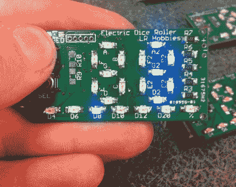

# 满足您所有 D&D 需求的无电池电子骰子

> 原文：<https://hackaday.com/2011/09/29/battery-less-electronic-dice-for-all-your-dd-needs/>

[安东尼]是《龙与地下城》的忠实粉丝，但他认为玩电子骰子比传统游戏更有趣。电子骰子在[这一带并不是什么新鲜的](http://hackaday.com/2011/09/27/attiny-hacks-two-dice-one-6-pin-uc/)，尽管我们不禁喜欢他的设计。

他想让他的电子骰子尽可能小，同时确保它可以持续整个游戏过程，所以他没有使用电池供电，而是选择了超级电容器。他的 1F 5.5V 电容让 PIC18 和 22 SMD LEDs 一直很好地突突前进，而无需中断充电。

电子骰子看起来很棒，只需按一下按钮，他就可以选择掷出 4、6、8、10、12 和 20 面骰子。虽然没有把骰子扔在桌子上那么互动，但我们当然不介意拥有一个。