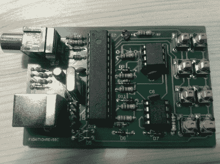

# BBC 报道一名老派黑客

> 原文：<https://hackaday.com/2011/04/29/bbc-covers-an-old-school-hacker/>

昨天，BBC [发布了一篇关于【Julian Skidmore】基于 AVR 的](http://www.bbc.co.uk/news/technology-13201254)[自制电脑](http://sites.google.com/site/libby8dev/fignition)的文章。

[Julian]的项目使用 AVR 和 Forth 的衍生物来重现过去 8 位计算机的功能。有了 8kB 的内存，[Julian]就可以运行一个电视输出，甚至包括一个月球着陆器游戏的代码。

我们很高兴(朱利安)获得了一些老派焊料猴子的恶名，但我们想知道为什么 BBC 要报道一个类似于每周一次在 hackaday 上可以看到的项目。这可能是普通大众眼中对黑客和 DIY 社区的第一次尊重吗？

无论如何，我们喜欢[Julian]在 BBC 文章底部的引言中所展示的主动性:“制造机器是学习计算机本质的一种方式。”如果你想了解什么，你必须自己去创造。更真实的话…