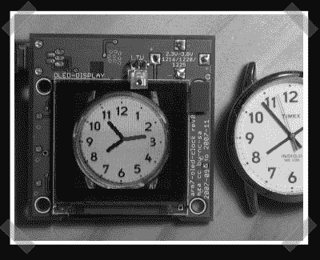

# 有机发光二极管风格的 30 度啤酒

> 原文：<https://hackaday.com/2008/04/04/beer-30-oled-style/>

【马特】建造了[这个](http://ohmslog.wordpress.com/2007/12/12/presentation-today/)有机发光二极管为他的电子类显示基础时钟。他使用 ARM7 处理器，为它设计了一个漂亮的定制板，然后开始忙碌起来。钟面其实就是手表的图片，指针随着时间的变化画在上面。为“每日一黑”的第一个有机发光二极管项目干杯。

*   [永久链接](http://ohmslog.wordpress.com/2007/12/12/presentation-today/)