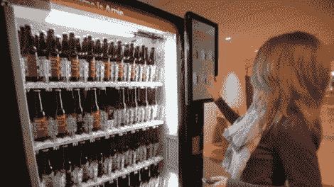

# 啤酒自动售货机与顾客交谈，通过 Twitter 宣布办公室聚会

> 原文：<https://hackaday.com/2011/11/25/beer-dispenser-talks-to-customers-announces-office-parties-via-twitter/>

唯一比啤酒更好的东西就是免费啤酒。

Arnold Worldwide 广告公司的员工可以在办公室的休息区自由饮酒，但一些员工认为让自动售货机出售他们的啤酒会非常棒。利用公司为“创意项目”预留的资金，他们建造了交互式啤酒自动售货机[Arnie]。

这台机器储存了公司品牌的啤酒，每个员工都带着一个预先装载了啤酒信用的 RFID 钥匙链。当冲动袭来时，工作人员在机器前刷一下他们的表链，从前置的大触摸屏上选择他们喜欢的饮料。[Arnie]与他的顾客交谈，并使用 Twitter 宣布正在举办的派对，在短时间内卖出了几瓶酒。

如果你问我们，这个项目是一个很大的资金使用，我们认为每个办公室都应该有一个这样的宝贝。

请继续阅读，观看一个短片，了解[阿尼]是如何诞生的。

[vimeo http://vimeo.com/32343283 w=470]