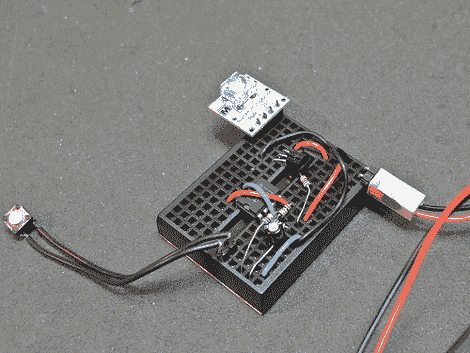

# 初学者概念:555 按钮开关

> 原文：<https://hackaday.com/2010/02/02/beginner-concepts-555-push-button-toggle/>

PIC、AVR 和 Arduino 如今在项目中无处不在，很多时候使用它们很容易使事情变得过于复杂。在这种情况下，[Tod]想要使用一个瞬间触觉开关来打开和关闭某些东西。他没有使用微控制器[，而是围绕 555 定时器](http://todbot.com/blog/2010/01/02/momentary-button-as-onoff-toggle-using-555/)构建了电路。在这种情况下，他真正需要的是一个触发器，但缺少芯片，因此他选择了 555，因为它有一个内置芯片。三个电阻和一个电容之后，他又增加了一个电阻和一个晶体管来处理负载切换。休息之后，我们嵌入了电路控制 LED 的视频。[这种 IC 在很多项目中都有应用](http://hackaday.com/2009/12/30/simplest-most-useless-machine/)所以，翻遍你的零件箱，试试这个电路吧。