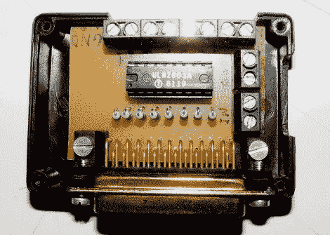

# 初学者概念:LPT 代替 UC

> 原文：<https://hackaday.com/2010/03/27/beginner-concepts-lpt-instead-of-uc/>

我们总是看到它，一个基于 Arduino 板的帖子，有很多评论称它过度杀戮。如果不使用微控制器(uC ),您应该如何控制自制的外围设备？[jba brams]和[Tim Gremalm]用这个[打印机端口(LPT)适配器](http://tim.crf.nu/robot-irc-bot-that-connects/)回答了这个问题。当 IRC 房间里有人和他们说话时，他们想要一个指示灯。通过继电器将蓝色旋转灯连接到这个表链的输出端，他们已经做到了，但还有更多空间。

适配器使用一个[达林顿晶体管](http://en.wikipedia.org/wiki/Darlington_transistor)阵列 IC 来保护计算机。芯片上 LPT 和管脚之间的电阻确保电流在计算机的安全范围内。达林顿晶体管使用外部电源放大输出，以驱动更重的负载。

如果你想对打印机端口[有更深入的了解，请查看本教程](http://www.beyondlogic.org/spp/parallel.htm)。LPT 端口变得越来越不常见，这就是为什么如此多的项目正在迁移到 USB(加上大多数 USB 连接的项目不需要外部电源)，但如果你有一个，它可能不会被用于其他任何事情。