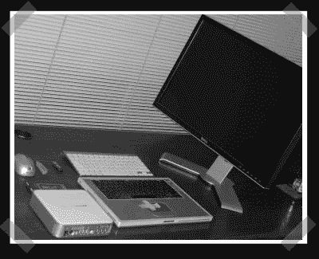

# 砍掉你的笔记本电脑

> 原文：<https://hackaday.com/2008/07/24/behead-your-laptop/>

【马克】发来这个妙招，让[给一台旧笔记本电脑注入新的活力](http://forums.macnn.com/69/mac-notebooks/371036/frankenstein-my-tibook-pics/)。[Sarc]有一个坏掉了 LCD 的 tibook。它仍然可以与外部显示器一起使用，所以他简单地拆除了坏掉的液晶显示器。tibook(和 MacBook)使用磁性传感器来监控 LCD 的位置。为了让机器处于正确的模式，他在适当的位置贴了一块磁铁，让机器认为显示器处于关闭位置。为了真正清理干净，他把所有的硬件都安装在桌子下面，并在机器上使用了无线键盘和鼠标。

*   [永久链接](http://forums.macnn.com/69/mac-notebooks/371036/frankenstein-my-tibook-pics/)