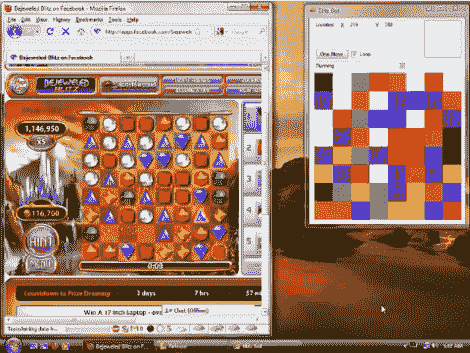

# 珠光宝气的闪电战机器人让你的高分看起来只是悲伤

> 原文：<https://hackaday.com/2011/07/30/bejeweled-blitz-bot-makes-your-high-score-look-just-sad/>

程序员不需要擅长某个游戏就能获得高分，他们可以为此编写一个机器人。以[催眠]为例。他正在学习用 C#语言写作，并决定制作一个在脸书上玩宝石迷阵的机器人。他估计自己在几周内花了 48 到 72 个小时编写代码，但是请记住，他同时也在学习语言。我们认为你很难独自达到 150 万的范围分数，即使有那么多的练习时间。

昨天下午，我们采访了[催眠师],以了解他是如何做到这一点的背景。他的代码(他没有发布，所以你必须自己写)抓取屏幕图像作为输入。你可以在广告之后的视频开头看到，他调整了应用程序的大小，以正确对齐网格中的每个宝石。然后，该程序通过找到单元的中心并采用 25 平方像素的平均颜色来识别每个游戏块。许多珠宝很容易在第一遍就被识别出来，但有些更难，需要几次不同的测试才能识别。那是困难的部分，选择最好的移动仅仅是提出你自己的关于机器人应该如何玩游戏的规则的问题。

[https://www.youtube.com/embed/h4BiLeKjXSA?version=3&rel=1&showsearch=0&showinfo=1&iv_load_policy=1&fs=1&hl=en-US&autohide=2&wmode=transparent](https://www.youtube.com/embed/h4BiLeKjXSA?version=3&rel=1&showsearch=0&showinfo=1&iv_load_policy=1&fs=1&hl=en-US&autohide=2&wmode=transparent)

[谢谢亚当]