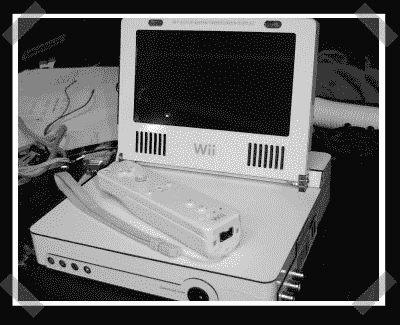

# Ben Heck 在 Engadget 上的 Wii 笔记本电脑

> 原文：<https://hackaday.com/2007/01/19/ben-hecks-wii-laptop-on-engadget/>

【本·黑肯登】在 engadget 上拼凑出这个[小美女](http://www.engadget.com/2007/01/19/the-wii-laptop/)。它不像 [XBox 360 笔记本电脑](http://www.hackaday.com/2006/09/10/xbox-360-laptop/)那样夸张，但这是有原因的。他将发布一系列关于建筑的操作指南。如果你一直在考虑自己建造一台便携式电脑，这将是你硬件黑客技术基础的一个很好的开端。

*   [永久链接](http://www.engadget.com/2007/01/19/the-wii-laptop/)