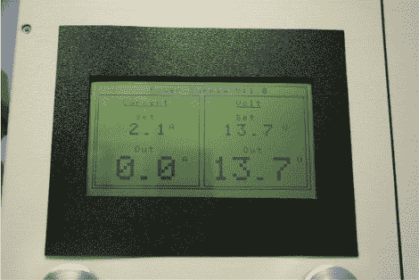

# 限流台式电源

> 原文：<https://hackaday.com/2010/10/08/bench-supply-with-current-limiting/>

这是一个台式[电源，电压可调，限流](http://www.microsyl.com/index.php/2010/03/31/bench-power-supply-0-25v-0-5amp/)。[Sylvain]的发明可以调节 0-25 伏电压，同时提供 0-5 安培电流。电流限制是一个很好的功能，因为它允许你测试你的原型，以确保你选择的功率调节器不会过大或过小。

这个补给真的是二合一。机箱有两个独立的电路，因此您可以同时使用不同的电源轨。有一个微控制器参与其中，但 ATmega32 除了测量电压和电流并驱动图形 LCD 屏幕之外没有做任何事情。两个电位计负责设置电压和限制电流。

[谢谢萨戈努特]