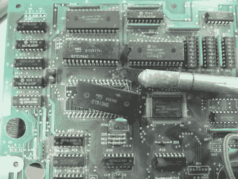

# 弯曲打印机控制板以输出 POV 消息

> 原文：<https://hackaday.com/2012/01/25/bending-a-printer-control-board-to-output-pov-messages/>

面对为他堆积如山的垃圾电子产品找到用途的问题，[Rue]开始使用硬件状态机构建一个[视觉暂留设备。我们怀疑，如果流量太大，他的原始链接可能会关闭，所以这里有一个缓存链接](http://eds.dyndns.org/~ircjunk/tutorials/elex/fsmflash/main.html)[，以防万一](http://backupurl.com/mdygsz)。

任何基于 MSC-51 或 MCS-48 的主板都可以满足他的要求。这是因为硬件的寻址方案使它很容易被破解。上图显示他正在从主板上切下处理器。之所以选择它，是因为一个 74HC373 起初这是一个错误，但由于它与 74HC374 引脚兼容，他需要一个简单的交换就成功了。从那里添加了时钟源，显示消息所需的地址信息被烧录到 EEPROM 中。

他的文章的第十二步展示了一个莫尔斯电码信息，通过将板子连接到一个扫帚柄上，并以弧形旋转它。我们只花了一分钟就破译了这条信息，并相信这是对黑客日的呐喊。很好，感谢阅读[Rue]！