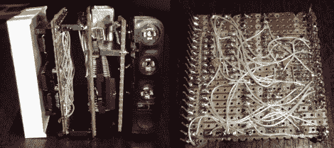

# 双色 LED 矩阵时钟采用点对点结构

> 原文：<https://hackaday.com/2010/12/22/bi-color-led-matrix-clock-uses-point-to-point-construction/>

[丹尼尔]希望他的孩子每天早上在床上呆到半体面的时间。问题是这个孩子不知道怎么看时钟，所以[丹尼尔] [给他做了一个时钟](http://blog.danielparnell.com/?p=103)。是啊，对我们来说也没什么意义，但是我们用自己不可靠的前提来做项目，那么我们有什么资格评判呢？

他使用双色 8×8 LED 矩阵作为时钟显示器。引起我们注意的是他为组成设备的三个条形板使用的点对点焊接。注意在需要时使用钻头断开痕迹。每块板子都有自己的用途；矩阵驱动器、逻辑板和电源板。PIC 18F4550 让[丹尼尔]通过 USB 控制时钟，并在该睡觉时以红色数字显示时间，在该起床时以绿色数字显示时间。有一个闪烁的像素代表秒，底部有一个二进制的分钟读数。

我们已经要求[丹尼尔]在显示时间时贴一张示意图和钟面图像。还没有消息，但我们会密切关注。同时，看看这个使用 RGB 8×8 LED 矩阵的[时钟。](http://hackaday.com/2009/09/21/blokclok-abstract-time-display/)