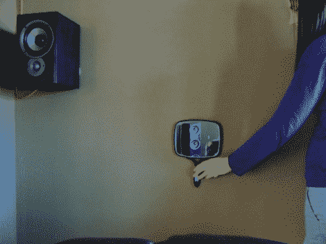

# 台球概念用于定位吸声板

> 原文：<https://hackaday.com/2012/02/29/billiards-concepts-plied-to-position-acoustic-panels/>

如果你对台球桌了如指掌，你应该能够运用这些技能来改善家庭影院的声音。[Eric Wolfram]发表了一篇文章，讨论了不必要的声音反射引起的问题，并向[展示了如何放置隔音砖](http://acousticsfreq.com/blog/?p=432)来解决这个问题。

这是他的指南[建造你自己的隔音砖](http://hackaday.com/2011/10/21/cheap-acoustic-panel-diy/)的姊妹篇。如果你还没有抽出时间做这件事，不要担心。只需一个木质框架、高密度玻璃纤维和一些布料，它们就能轻松搭建。它们也很容易悬挂，但直到现在，你可能只是猜测它们应该放在哪里。

一旦所有的演讲者和座位都就位，拿一面镜子和一些便利贴。作为观察者坐下，让一个朋友操作镜子，如上图所示。把它平贴在墙上，用便利贴在每个你能看到其中一个演讲者影子的地方做上标记。寻找反射点就像在台球中排列一排击球杆。使用五个扬声器(5.1 环绕声)和六个表面(墙壁、天花板和地板)，您应该能够标记 30 个反射点。现在决定你打算如何疯狂地进行这个项目。最好的结果是处理所有 30 个反射点，但是如果你更保守一点，你可以只处理前面的标记。