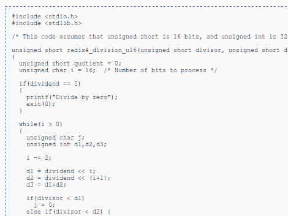

# 二进制除法当你的处理器缺少硬件除法时

> 原文：<https://hackaday.com/2011/12/01/binary-division-when-your-processor-lacks-hardware-division/>

当你使用的芯片没有除法指令时，我想看看除法运算。他指出，除法指令在芯片上占用了大量空间，这就是为什么它有时会被排除在芯片的指令集之外。例如，他告诉我们 Raspberry Pi 上使用的 ARM 处理器没有除法指令。

没有硬件除法，你只能[实现二进制除法算法](http://ec2-122-248-210-243.ap-southeast-1.compute.amazonaws.com/mediawiki/index.php/Binary_division)。最终[仓鼠]计划在 FPGA 中实现这一点，但开始通过在 AMD 处理器上比较 C 语言中的除法算法来研究该项目。

他的测试使用了被除数和除数的所有 16 位可能性。他震惊地发现，对于同样的测试，二进制除法并不比使用硬件指令花费更长的时间。稍微研究了一下他的代码，他设法以 175%的速度击败了 AMD 硬件除法指令。当用英特尔芯片测试时，硬件比他的代码快 62%。

他对为什么会看到这些性能差异有一些理论，我们会让你自己去验证。