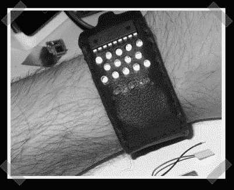

# 二元视点观察

> 原文：<https://hackaday.com/2008/02/23/binary-pov-watch/>

我可能还不会更换我的巨型 G-shock 手表，但[这款](http://cre.ations.net/creation/binarypov-custom-wristwatch)二元 POV 手表非常可爱。当然，POV 时钟现在已经过时了，但它也是向嵌入式项目添加锂离子电池的一个很好的例子。它使用 MAX1555 锂离子充电器，并且不顾一切，不需要任何外部电容。如果手表处于闪光灯模式，电池续航时间为几天或几个小时。

*   [永久链接](http://cre.ations.net/creation/binarypov-custom-wristwatch)