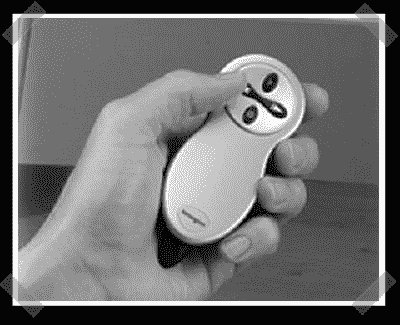

# 黑帽 2007 其他无线

> 原文：<https://hackaday.com/2007/08/02/black-hat-2007-other-wireless/>

Luis Miras 发表《其他无线:被 Pwned 的新方式》。与蓝牙或 WiFi 等常见的欺诈话题不同，这次讨论的是用于无线键盘、鼠标和类似上图无线遥控器的廉价收音机。这些 RX/TX 对有 27MHz、900MHz 和 2.4GHz 版本。这些设备都使用相同的主要部件:微控制器、用于存储序列号的 EEPROM 和发射器。除了接收器之外，加密狗几乎是相同的。

Luis 首先访问 FCC 网站，开始逆转 Kensington Wireless Presenter。所有的无线电设备都必须经过他们的评估。只需在设备底部键入 FCC 编号，在某些情况下，您甚至可以获得完整的原理图。然后，他可以获取无线电的数据手册。通过添加您自己的微控制器，您可以向加密狗发送任意按键，或者您可以点击 RX 侧，轻松创建一个嗅探器。不过要逆转这个协议，你需要一个示波器或者更好的 T2 逻辑分析仪。

他演示了一个重放攻击:反复发送 page up 命令。不幸的是，被黑的无线演示者没有完整的键码空间，所以你不能向它发送任意按键。Luis 仍然需要破解无线键盘加密方案，以便创建一个有用的按键嗅探器。