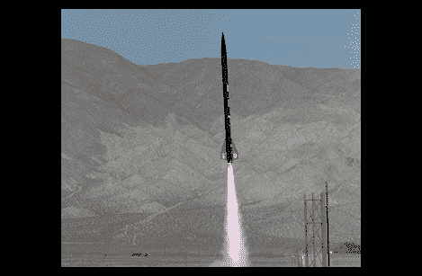

# 用全球定位系统发射

> 原文：<https://hackaday.com/2011/02/20/blasting-off-with-gps/>

发射模型火箭是一段美好的时光，但通常情况下，很难判断火箭飞得多高或移动得多快——这两个都是吹嘘你最近一次飞行的基本事实。[克里斯]最近为南加州大学火箭推进实验室建造了一个基于 GPS 的高度计，这样他们就可以跟踪他们最新项目的表现。该电路基于 Picaxe 18x，并使用 GPS 模块获取 NMEA 海拔数据。一旦获得数据，它就被存储在外部 EEPROM 中，以便在火箭回收后被读取。

[Chris]很遗憾，他没有自己制作的电路板的任何图片，但他提供了电路图和源代码。他报告说，除了 GPS 模块暂时失去卫星锁定的一小段时间之外，记录器工作正常。

如果你有兴趣阅读更多关于飞行数据记录和遥测的内容，请务必[查看](http://hackaday.com/2011/02/17/model-rocket-radio-telemetry/)。