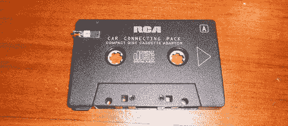

# 蓝牙盒式适配器

> 原文：<https://hackaday.com/2011/09/11/bluetooth-cassette-adapter/>

今天，有了可以容纳全部音乐收藏的 iPods 和从网上下载音乐的手机，这种不起眼的盒式磁带似乎不合时宜了。[Matt]在他的卡车上仍有一个卡式录音机，但他想为他的立体声系统提供蓝牙连接。显而易见的解决方案是[将蓝牙耳机塞进盒式适配器](http://hovisprojects.blogspot.com/2011/08/bluetooth-cassette-adapter.html)。

盒式录音带适配器是非常简单的设备。它们实际上只是一个磁带头，塞在盒式磁带的外壳里，是一条通向媒体播放器的电线。为了把蓝牙装进他的适配器，[马特]得到了一副便宜的蓝牙耳机，并把它们拆开。他只剩下一个电路板、电池和两个耳机。[马特]切断耳机的引线，把它们连接到盒式适配器头上。在对外壳做了一点点修改后，[Matt]有了一个功能性的蓝牙盒式适配器。

虽然[Matt]确实可以花 10 美元从中国买到现成的蓝牙卡带适配器，但只买一个并没有太多乐趣。(马特)走家庭酿造路线值得称赞。