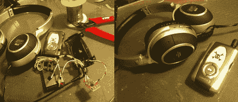

# 蓝牙耳机电池交换持续进行…

> 原文：<https://hackaday.com/2011/04/06/bluetooth-headset-battery-swap-keeps-going-and-going/>

[雷吉纳多]购买了一个便宜的蓝牙耳机适配器，虽然它在他的所有设备上都运行良好，但他失望地发现电池寿命并不完全符合制造商的声明。广告宣称可以工作 10 个小时，他发现这种设备通常在 7 小时后就会失效。他想从耳机中得到更多，所以他把东西拿在自己手里，[换成了更大的电池](http://queroumdeste.blogspot.com/2010/12/dispositivo-bck-08-stereo-bluetooth.html) ( [谷歌翻译](http://translate.google.com/translate?js=n&prev=_t&hl=en&ie=UTF-8&layout=2&eotf=1&sl=auto&tl=en&u=http%3A%2F%2Fqueroumdeste.blogspot.com%2F2010%2F12%2Fdispositivo-bck-08-stereo-bluetooth.html))。

他的目标是让改造尽可能便宜，所以他重新利用了他在家里的很多物品。他使用了一个旧手机的电池，容量比他原来的耳机电池大六倍以上。他使用 MCP73863 微芯片构建了一个充电电路，专门用于管理锂离子/锂聚合物电池。蓝牙耳机被拆开，重新包装在他手头的一个便宜的“音频放大器”的外壳里，还有新的电池和充电电路。一个漂亮的 Hackaday 标志被印在了新电池盒的外面，这个项目被认为完成了。

[雷吉纳多]报告说他对他的电池改造很满意。新的电源模块充电只需要半个小时，但现在可以使用大约 44 小时，才需要充电——不算太差！