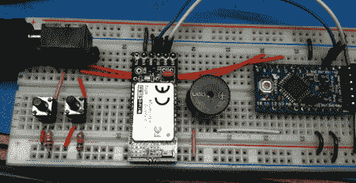

# 残疾人用蓝牙莫尔斯电码键盘

> 原文：<https://hackaday.com/2011/08/02/bluetooth-morse-code-keyboard-for-the-disabled/>

a Zunkworks 团队想为那些不能正常使用键盘和鼠标的人制造一种设备。蓝牙莫尔斯电码键盘是他们想出来的。这种构建让用户可以使用一个按钮或一个 sip & puff 界面来完全控制键盘和鼠标。

该项目是围绕一个 Arduino ProMini、一个 FTDI 分线板和一个[蓝牙模块](http://www.inmojo.com/store/jeff-rowberg/item/wt12-uart-bluetooth-breakout-board/)构建的。这是一个相当简单的构建，但是项目的核心在于[代码](https://code.google.com/p/bluetooth-morsecode-keyboard-mouse/)。每一次击键和鼠标移动只需要按几下按钮。

像我们去年看到的 [USB 莫尔斯电码键盘](http://hackaday.com/2010/05/27/usb-morse-code-keyboard/)一样，这个项目也将 dits 和 dah 翻译成键盘上可用的字符。事实上，Zunkworks 甚至使用了这种 USB 莫尔斯键盘的代码作为参考。只有一个用户输入按钮，我们想起了[斯蒂芬·霍金的计算机界面](http://video.google.com/videoplay?docid=-1567445358427804721)。这个项目可能是对霍金系统的改进，因为它允许控制鼠标光标。

看看下面莫尔斯键盘的视频。

[https://www.youtube.com/embed/2mTEevUbbUU?version=3&rel=1&showsearch=0&showinfo=1&iv_load_policy=1&fs=1&hl=en-US&autohide=2&wmode=transparent](https://www.youtube.com/embed/2mTEevUbbUU?version=3&rel=1&showsearch=0&showinfo=1&iv_load_policy=1&fs=1&hl=en-US&autohide=2&wmode=transparent)