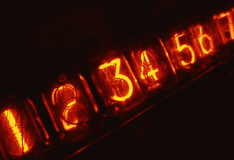

# [Bob]向我们展示如何为老式电脑爱好者制作 DIY 日历

> 原文：<https://hackaday.com/2011/12/29/bob-shows-us-how-to-make-diy-calendars-for-vintage-computer-geeks/>

[Bob Alexander]来信分享了他的一个爱好，考虑到新年即将来临，我们认为这是非常及时的。几年来，他已经为自己制作了一个定制日历，包括他认为重要的两个日期，以及老式电脑设备的甜蜜图片。朋友和家人觉得他的日历非常有趣，所以也请他为他们制作一些。

每年他的日历请求越来越多，他发现没有任何渠道——网上或其他方式——能完全满足他的需求。他没有满足，而是编写了一个小应用程序，让他随心所欲地定制和打印日历。

我们认为这比在当地书店买一本要酷得多，我们猜测我们的读者可能会同意这一点。如果你要创建自己的日历，你会选择展示什么样的老式电脑硬件？如果你正在设计一个黑客日日历呢？请在评论中告诉我们——在我们倒数新年前夜的时候，我们渴望找到一些有趣的东西来看看！