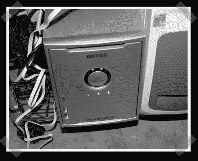

# 奖励:水牛城 Terastation 黑客

> 原文：<https://hackaday.com/2007/03/20/bonus-buffalo-terastation-hacking/>

只是为了纪念我的新玩具而奖励的黑客:一个 ~~1GB~~ 1TB 的水牛城 Terastation NAS。这些小家伙运行嵌入式 Linux，并且拥有不错的[用户群](http://www.terastation.org/wiki/Main_Page)。我的电脑配有 128MB 内存、四个三星硬盘(每个都有自己的 IDE 总线)、RAID 支持、千兆以太网、USB 2.0 和一个摩托罗拉 Sandpoint cpu。(把它与我的旧 Powermac 8500 相提并论)维基上有所有[基本技巧](http://www.terastation.org/wiki/Hacking)的说明。安装一些被黑客攻击的固件[非常容易，并产生 telnet 和 root 访问。它有一个用于 UPS 控制的串行端口，但是有一个很好的干净的接口用于](http://www.terastation.org/wiki/Hacking#Firmware_Hacking)[启用串行控制台访问](http://www.terastation.org/wiki/Serial_console)。

*   [永久链接](http://www.terastation.org/wiki/Hacking)