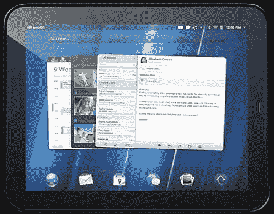

# 惠普 Touchpad Android 端口的奖金

> 原文：<https://hackaday.com/2011/08/22/bounty-for-an-hp-touchpad-android-port/>

如果你在户外度过周末，远离互联网，你可能会错过亚马逊、woot.com、沃尔玛和惠普在线商店对惠普触摸板的大规模清算。通常情况下，100 美元的全功能平板电脑没什么可嘲笑的，但有一个问题:惠普 TouchPad 运行 WebOS。WebOS 对于平板电脑来说是一个很好的操作系统，但它不是 Android。HacknMod.com[的人贴出奖金](http://hacknmod.com/hack/hp-touchpad-android-1500-prize/)，奖励第一个将安卓移植到惠普 TouchPad 的人。

HacknMod 为一个基本的 Android 端口提供了 450 美元，并正在为 WiFi、音频、摄像头和多点触摸奖金寻找赞助商。如果你想知道项目进展如何，XDA 开发者论坛和 T2 RootsWiki 论坛上有很多关于这个端口的讨论。触摸板[已经扎根](http://wiki.rootzwiki.com/index.php/HP_Touchpad)所以这是你的起点。

我们想参加竞选，但是我们错过了 TouchPad 的大甩卖。如果任何人知道他们仍然可用的在线商店，在评论中留下信息。

途经[HacknMod.com](http://hacknmod.com/)