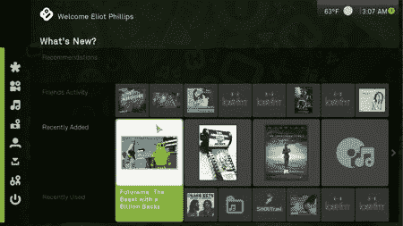

# Apple TV 2.3 固件上的 Boxee

> 原文：<https://hackaday.com/2008/11/24/boxee-on-apple-tv-23-firmware/>

我们听到了一些散布恐惧的消息，苹果发布了苹果电视固件 2.3(T1)来打破(T2)盒子(T3)和 XBMC。这当然是升级的副作用，但现在[已经不重要了](http://blog.boxee.tv/2008/11/23/boxee-on-apple-tv-23/ "boxee blog » boxee on Apple TV 2.3")，因为新版本的 [ATV USB Creator](http://code.google.com/p/atvusb-creator/ "atvusb-creator - Google Code") 已经发布，可以与新固件一起工作。因此，对于两个媒体中心程序来说，一切基本上都恢复了正常。