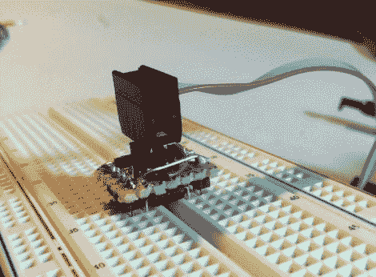

# 面包头使 AVR 编程变得轻而易举

> 原文：<https://hackaday.com/2011/10/02/bread-head-makes-avr-programming-a-snap/>

[Quinn]blondi hacks 最近一直在使用 AVR 微控制器，希望在芯片仍在试验板上时，有一种快速的方法来对 ATtiny13a(她当前选择的 AVR)[进行编程。](http://quinndunki.com/blondihacks/?p=550)

为了加速代码修改和测试，她构建了一个小的编程头，她称之为 Bread Head。该设备非常简单，只不过是由可咬合的插头和一点倒置的原型板组成。

她将六个接头焊接到电路板的顶部(以前是底部),同时将一组八个超大接头焊接到编程器的反面。在[Quinn]将接头紧贴在 ATtiny 顶部并对其进行快速测试之前，小块导线被焊接在一起，将所有合适的引脚连接在一起。一切工作都很完美，所以她涂了厚厚的环氧树脂来加固，然后就到此为止了。

她说，程序员工作得很好，她可能会为其他常见的 AVR 也做一个类似的标题。