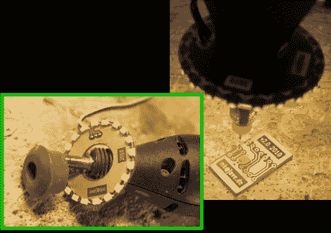

# 点亮你的 PCB 钻孔站

> 原文：<https://hackaday.com/2010/05/30/brighten-up-your-pcb-drilling-station/>

能够看到你在做什么可能是在那些新蚀刻的印刷电路板上钻通孔最困难的部分。我们不知道为什么我们没有想到这一点，但[Markus Gebhard]用他的[20 LED Dremel 光环](http://www.jave.de/blog2/?p=59)解决了他的阴影困境。老实说，多少次我们在摄影中看到[光环，却没有想到一个光环非常适合这个目的。所以向马库斯致敬，现在我们必须去挖一些表面贴装 led 和](http://hackaday.com/2009/11/16/led-ring-light/)[打开氯化铜](http://hackaday.com/2010/05/07/toner-transfer-explained-step-by-step/)。