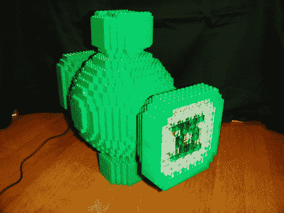

# 最明亮的白天，最黑暗的夜晚，用 Arduino 的光充电

> 原文：<https://hackaday.com/2010/10/16/brightest-day-darkest-night-charge-it-with-arduinos-light/>

使用绿灯侠誓言是一种亵渎。但是当你看到这个[绿灯侠电池和戒指项目](http://www.justjon.net/lego/lego-green-lantern-power-battery/)时，请冷静一下你的愤怒。[Jon]用乐高建造了动力电池部分，但在里面你会发现一个额外的奖励。Arduino 使用一组 led 和一个 RFID 阅读器来激活对象。一个匹配的环包含 RFID 标签，当举起灯笼的镜头时，它会激活灯。你可以在休息后的视频中看到这个用来给动力环充电(并通过说誓言加入进来)。

想要建造这样的东西，但没有 RFID 阅读器？这很容易做到，只要在戒指上加一块磁铁，在灯笼上加一个霍尔效应传感器。也许这会让你重新考虑你今年的万圣节服装。

[https://www.youtube.com/embed/Pw1dTOP2eo4?version=3&rel=1&showsearch=0&showinfo=1&iv_load_policy=1&fs=1&hl=en-US&autohide=2&wmode=transparent](https://www.youtube.com/embed/Pw1dTOP2eo4?version=3&rel=1&showsearch=0&showinfo=1&iv_load_policy=1&fs=1&hl=en-US&autohide=2&wmode=transparent)

[谢谢雨果]