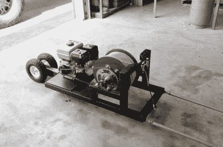

# 为滑水运动建造一个海滩绞盘

> 原文：<https://hackaday.com/2010/10/05/build-a-beach-winch-for-wakeboarding/>

这是一个不错的海滩绞车的建造日志，供你下次去海滩绞车时使用。海滩滑水是指你用岸上的快速绞盘拉你下水，这样你就可以滑水、滑水或滑水，而不需要波浪、船或水上摩托拉你前进。虽然这里没有什么惊人的突破性的东西，但是我们确实喜欢一个记录良好的构建日志。我们认为远程初始化拉的方法也不错。

休息之后，你可以看到一段海滩冲浪的视频

[https://www.youtube.com/embed/nciyAvHJZ7c?version=3&rel=1&showsearch=0&showinfo=1&iv_load_policy=1&fs=1&hl=en-US&autohide=2&wmode=transparent](https://www.youtube.com/embed/nciyAvHJZ7c?version=3&rel=1&showsearch=0&showinfo=1&iv_load_policy=1&fs=1&hl=en-US&autohide=2&wmode=transparent)