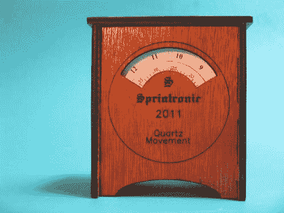

# 用表盘代替指针制作一个时钟

> 原文：<https://hackaday.com/2011/08/28/build-a-clock-using-dials-instead-of-hands/>

道格·帕拉迪斯发现了一种简单的方法，用表盘代替时钟上的指针。实际上，这差不多就是全部的诀窍了…用拨号盘代替指针。他从业余爱好商店里拿了一个电池驱动的时钟机芯，然后打印出一个小时的表盘，另一个分钟的表盘，罗伯特是你妈妈的兄弟，你有了一个新的时钟。上面看到的表壳是激光切割的，有一个窗口和索引线，可以帮助你精确地读取时间。

但我们不想建一个案子，我们想用一些复古设备试试这个。首先想到的是更换坏掉的频闪仪上的圆盘，就像康恩用来制造的大表盘型号[。如果你不喜欢笨重的音乐硬件时钟，也许有一个旧的万用表，或者一个面板表可以重新用于这一目的。我们知道【道格】已经](http://www.youtube.com/watch?v=j_G66Bl_6KU)[有一些针米](http://hackaday.com/2010/09/02/meter-clock-using-the-ti-launchpad/)坐在周围，这将是完美的。