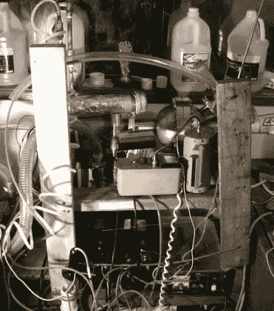

# 在你的家里建造一个聚变反应堆

> 原文：<https://hackaday.com/2010/12/27/build-a-fusion-reactor-in-your-home/>

起初，我们对这个自制的聚变反应堆非常怀疑。然而，我们以前见过[自制的聚变反应堆](http://hackaday.com/2010/06/24/fusion-in-my-backyard/)，所以我们猜测这在技术上是可能的。光是建筑本身就足够有趣，值得一看。

我们不是专家，所以如果我们不能告诉你到底发生了什么，请原谅我们，但我们可以欣赏建造过程中所涉及的工艺。真空室特别好。

我们知道，我们的一些评论者可能在这里有更多的经验。告诉我们，这东西看起来合法吗？