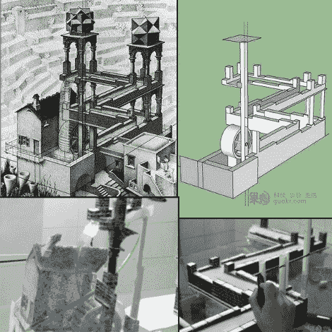

# 建造一个现实生活中的埃舍尔瀑布

> 原文：<https://hackaday.com/2011/04/29/build-a-real-life-eschers-waterfall/>

Instructables 用户[GuokrDIY]提供了一份详细指南的[译文](http://www.instructables.com/id/Perpetual-Motion-Machine-The-real-life-version-of/),指导我们制作一个我们最喜欢的埃舍尔灵感错觉图。不像[以前的](http://hackaday.com/2011/03/03/how-eschers-impossible-waterfall-was-faked/)推测的埃舍尔瀑布的解决方案，这一个设法保持水路径连贯，直到顶部水平。整个装置的诀窍是非常小心地控制视角，使水源和出水口重叠。我们说是水，但出于某种原因，建造者实际上使用“厕所清洁剂”作为液体……无论如何，*液体*被允许向下流动，直到它到达不存在的第四个角落。液体实际上从桌子的一端(看不见的地方)落到一个盆里。盆中一个精心定时的泵将液体通过模型的一根柱子推至瀑布顶部，然后从轮子上倾泻而下。

使用 sketchup 来模拟瀑布的各种结构组件，该设计由 PVC 和 ABS 塑料制成，然后用贴图纹理蒙皮，以确保一切看起来连贯。通过摄像机观看整个设置，可以对视觉细节进行微调。这种错觉最难的部分似乎是调节泵的功率，以便根据液体的流动来调节时间。

我们只希望关于厕所清洁剂的那件事是误译，或者是对最初中文文章的某种讽刺。查看模型在跳跃后的运行情况！

[https://www.youtube.com/embed/wbi8-L-TJkA?version=3&rel=1&showsearch=0&showinfo=1&iv_load_policy=1&fs=1&hl=en-US&autohide=2&wmode=transparent](https://www.youtube.com/embed/wbi8-L-TJkA?version=3&rel=1&showsearch=0&showinfo=1&iv_load_policy=1&fs=1&hl=en-US&autohide=2&wmode=transparent) [https://www.youtube.com/embed/8leA2SWBzc0?version=3&rel=1&showsearch=0&showinfo=1&iv_load_policy=1&fs=1&hl=en-US&autohide=2&wmode=transparent](https://www.youtube.com/embed/8leA2SWBzc0?version=3&rel=1&showsearch=0&showinfo=1&iv_load_policy=1&fs=1&hl=en-US&autohide=2&wmode=transparent)