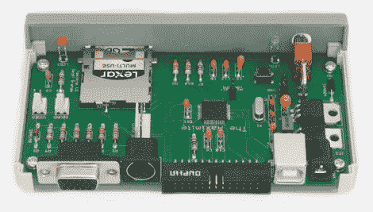

# 构建一个独立的 BASIC 解释器

> 原文：<https://hackaday.com/2011/06/22/build-a-standalone-basic-interpreter/>

这里有一张[Geoff]为 Maximite 制作的电路板的照片，Maximite 是一个基本的解释器。当他探索 PIC32 系列芯片的可能性时，他萌生了这个设计想法。[Geoff]想为杂志写一篇关于硬件的文章，但需要一个实际的产品来展示它。

该设计可以利用两个微处理器之一，PIC 32MX795F512H 或 32MX695F512H。32 位芯片有足够的能力来模拟 BASIC，甚至允许浮点计算。它的 VGA 兼容，并有一个标准的 PS/2 键盘插孔，这使它成为一个独立的设备。您可以将程序存储在 SD 卡上，或者通过电源插孔旁边的 USB-B 端口与电脑连接。微处理器是一个表面贴装芯片，但其余的组件是通孔，使这是一个容易组装的套件。但是如果你不怕蚀刻自己的两层 PCB，在[Geoff 的]下载包中有电路板插图。

[谢谢比尔]