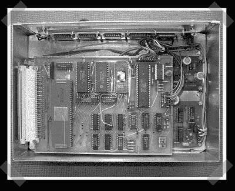

# 建立自己的全球定位系统和 GLONASS 接收器

> 原文：<https://hackaday.com/2007/10/04/build-your-own-gps-and-glonass-receiver/>

[superlopez]在[发来了这篇详细的文章](http://lea.hamradio.si/~s53mv/navsats/theory.html)(镜像[这里](http://www.s5tech.net/s53mv/navsats/theory.html)和[这里](http://s53mv.s56g.net/navsats/theory.html))描述了如何建立一个 GPS 和 GLONASS(俄罗斯版本的 GPS)接收器。与那些微小的蓝牙 USB GPS 单元相比，最终的设备是巨大的，但建立自己的接收器的能力是我肯定想要拥有的后世界末日技能之一。这篇文章的作者[马特加斯·维德马尔]又名[S53MV]也有关于[分组无线电](http://lea.hamradio.si/~s53mv/bpskdem/bpskdem.html) (PKT)收发器改进的页面( [PKT](http://en.wikipedia.org/wiki/Packet_radio) 获得了我对最佳后启示录技术的投票，也是变形金刚电影中唯一可信的技术)，以及比今年夏天早些时候展示的[更复杂的自制](http://www.hackaday.com/2007/07/29/diy-frequency-meter/)[频率计数器](http://lea.hamradio.si/~s53mv/counter/history.html)。

2005 年，我们推出了一款从零开始的 GPS 接收器,尽管项目网站似乎已经关闭。如果你的 GPS 单元只是需要一个更好的天线，看看[威尔]去年的[如何做](http://www.engadget.com/2006/03/28/how-to-add-your-own-external-gps-antenna/)。

*   [永久链接](http://lea.hamradio.si/~s53mv/navsats/theory.html)