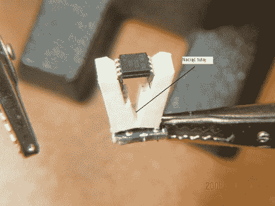

# 构建您自己的 SOIC 编程剪辑

> 原文：<https://hackaday.com/2010/11/18/build-your-own-soic-progamming-clip/>

[Pyra]正在寻找一种对 SOIC 封装中的 13 个微控制器进行重新编程的方法。他正在重新设计一些消费电子产品，因此在设计中添加 ISP 头不是一个选项。他一直在将电线焊接到每个芯片的引脚上，但这相当繁琐。他需要的是一个适配器，可以与腿进行足够长时间的物理接触，以编写新的固件。环顾四周，他发现一个 PCI 插座可以用作编程夹子。它与标准的 SOIC 封装具有相同的间距，但宽度不足以容纳芯片。他切下 4 排插座和主板上焊接的部分。然后，他从塑料中间切开，将两部分分开。上图说明了这一点，但没有显示他后来添加的连接到设备的八根电线。

我们想知道这是否可以适用于编程 SOIC 零件，而无需将它们从电路板上移除。这将是一个完成 LED 灯泡破解的便捷工具。