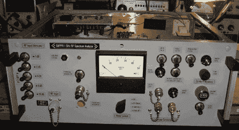

# 为无线电爱好者打造更好的频谱分析仪

> 原文：<https://hackaday.com/2011/02/08/building-a-better-spectrum-analyzer-for-radio-enthusiasts/>

这个频谱分析仪项目旨在提高业余无线电操作员可用工具的质量。设计中考虑了很多，详细的项目日志中分享了这些细节。该案例最初是一个有线电视链接发射机，但上面看到的大多数控制已被添加到这个建设，与未使用的洞填补和完成，以实现干净的外观。

一个值得注意的部分是建造一个看起来相当复杂的 1013.3 MHz 腔体带通滤波器的时间。尽管努力了，过滤器还是不起作用。细节有点粗略，但似乎一些额外的调整使其符合规格，以完成器件的这一部分。

这当然让其他[玩具频谱分析仪](http://hackaday.com/2010/03/17/im-me-spectrum-analyzer/)看起来像……玩具。

[谢谢威廉]