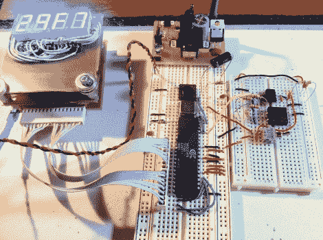

# 围绕 6502 处理器构建计算机

> 原文：<https://hackaday.com/2011/11/30/building-a-computer-around-a-6502-processor/>

到了尝试一些老派计算的时候，[Quinn Dunki] [抓起一个 6502 处理器开始工作](http://quinndunki.com/blondihacks/?p=680)。对于那些不熟悉的人来说，这是第一个功能强大、价格合理的[芯片，并且在 20 世纪 70 年代的业余计算市场上可以买到](http://en.wikipedia.org/wiki/6502)。它们被用于苹果电脑、Commodore 64 和许多其他硬件。

用芯片制造东西的首要任务是建立一个时钟信号。她采购了一个运行频率为 1 MHz 的晶体振荡器，但也想选择单步执行代码。她的解决方案是将两个时钟信号合二为一。一个拨动开关允许她选择晶体，或者一个 555 定时器电路，它使用一个按钮来触发每个时钟脉冲。

休息后，请观看视频，了解一些单步动作。目前船上还没有记忆。但是输入引脚已经硬连线到电压或地，以模拟数据输入。我们想知道她对压制数据总线逻辑的项目做了什么。看起来在这个项目中极其有用！

[https://www.youtube.com/embed/K2BQP-yU3AM?version=3&rel=1&showsearch=0&showinfo=1&iv_load_policy=1&fs=1&hl=en-US&autohide=2&wmode=transparent](https://www.youtube.com/embed/K2BQP-yU3AM?version=3&rel=1&showsearch=0&showinfo=1&iv_load_policy=1&fs=1&hl=en-US&autohide=2&wmode=transparent)