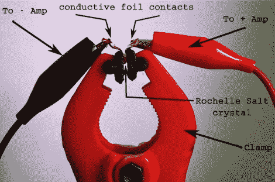

# 用自制压电晶体制作接触式麦克风

> 原文：<https://hackaday.com/2011/08/22/building-a-contact-mic-using-homemade-piezo-crystals/>

[Leafcutter]热衷于制作音乐，多年来已经将各种乐器和工具整合在一起。最近，他受到启发制作了自己的压电晶体，并写信来与我们分享他的实验结果。

【切叶刀】对[摆弄压电元件](http://hackaday.com/2010/02/17/now-you-can-record-mermaids-singing/)并不陌生，在看到[【科林】在家制作自己的压电晶体](http://hackaday.com/2011/03/15/cooking-up-piezo-crystals-at-home/)的教程后，他知道他必须试一试。他顺道去杂货店买了所有的配料，然后不折不扣地按照(科林的)指示去做……嗯，差不多。看起来他可能冷却溶液太快了，所以他发现自己有一个装满微小的，几乎不能使用的压电晶体的罐子，而不是像[科林]能够生产的更大的。

他没有被吓住，决定看看这东西是否有用，于是用一些导电箔和一个夹子组装了一个临时的接触式麦克风。他用管道把输出送到他的放大器，你难道不知道吗…它起作用了！

他在自己的网站上有一个麦克风声音的小片段，尽管晶体很小，但效果相当不错。他将再次尝试整个过程，所以我们希望在不久的将来看到更多更大晶体的实验。