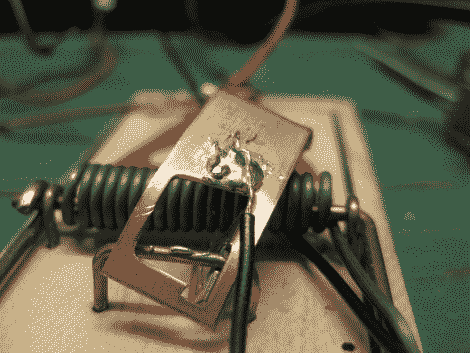

# 建造一个死老鼠的开关

> 原文：<https://hackaday.com/2011/02/23/building-a-dead-mouses-switch/>

[奈德]在一个非常不舒服的地方遇到了老鼠的问题。

不，不像大众车的后座，在他的天花板上。他想在那里放一个捕鼠器来照顾小动物，但是知道几天后一个被绊住的捕鼠器会有多脏，他犹豫了。他回忆起他在网上看到的一个项目，一个捕鼠器就像一个死人的开关一样，他开始工作[组装自己的捕鼠器](http://nedfunnell.blogspot.com/2011/02/okay-so-i-just-installed-electronically.html)。

他从房子周围清理出一些零件，给捕鼠器装上电线，这样只要捕鼠器没有被毫无防备的老鼠咬到，一对发光二极管就会亮着。一旦一只老鼠被捕鼠器困住，它的电路就会断开，发光二极管就会熄灭，让[内德]知道是时候把头探回天花板清理干净了。

虽然他的陷阱显然是低技术含量的，但我们总是喜欢看到一种廉价而简单的解决恼人的日常问题的方法。