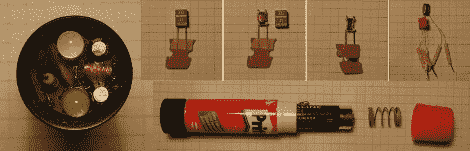

# 制作一个胶棒手电筒

> 原文：<https://hackaday.com/2010/06/09/building-a-glue-stick-flashlight/>

制作一个 LED 手电筒很简单，对吗？拿一块电池，通过电阻连接到 LED 上。好吧，聪明的家伙，现在做一个逐步增加多个 led 的电压，不要使用升压转换器 IC 这样做。

[fede.tft]分享[一个内置于用过的胶棒盒](http://www.webalice.it/fede.tft/torcia/torcia.html)中的手电筒。这是一块 AA 电池的完美尺寸(我们一直在寻找[的好电池盒](http://hackaday.com/2010/02/04/battery-holder-reuses-blister-pack/))，也是我们熟悉的手电筒形状。问题是，他想要两个白色 led，但只有一个 AA 电池，他永远不会有超过 1.5V 的可用电压。他解决了这个问题，通过使用一个晶体管、一个电感和三个无源元件设计自己的升压转换器，达到了 7.2V。为了得到他需要的感应器，一个库存零件被拆卸并重新缠绕以适应。也许当一切都结束时，你只是拿着手电筒，但话说回来，[西斯廷教堂](http://en.wikipedia.org/wiki/Sistine_chapel)只是天花板上的一些画。