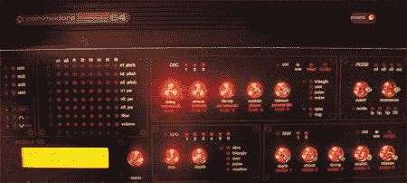

# 构建 MIDIbox SID

> 原文：<https://hackaday.com/2008/06/05/building-a-midibox-sid/>

[我们在](http://www.hackaday.com/2007/05/23/mb-6582-diy-c64-based-midi-synth/)(以及之前的[)之前已经讨论过 MIDIboxes 了，但是我们从来没有真正告诉过你它们包含了什么或者如何构建一个 MIDIboxes。休息之后我们将带你经历整个过程。](http://cellphones.hackaday.com/2005/01/16/midibox-sid-serious-c64-sound/)

由[Subatomic]设计的这个特殊的 midi box 是建立在 midi box SID specs[的基础上的，最初由[Thorsten Klose]](http://www.ucapps.de/midibox_sid.html)(查看伟大的声音样本)和[Wilba]简化的[构思。它使用 Commodore 64 外壳、8 个 SID 芯片和电源，但从各种不同来源获得大多数其他部件。Commodore 的声音接口设备是个人电脑中最早的声音芯片之一。](http://www.midibox.org/dokuwiki/wilba_mb_6582)

在工作日志中，一个 SID 模块，四个模块中的第一个，是在其他模块之前构建的。然后[Subatomic]打开了 Commodore 的箱子，试图在里面安装一些模块。对于 MIDIbox 的电源，他将原来的 Commodore 电源转换为 14VDC 和 5VDC，但后来发现这只能为 4 个 sid 提供足够的电源，从而导致了单声道 MIDIbox。他接着添加了一个电源板，并指出，有了核心和 SID 模块以及音频混音器板，这是一个紧密但可行的配合。

接下来的几个步骤包括设计和构建控制表面。在创建了一个模型并获得了几个组件，如旋钮，led 和一个小型 LCD 之后，[Subatomic]开始建造许多必要的控制表面 PCB，包括滤波器控制 PCB 和其他一些 PCB。

[亚原子]继续经历为旋钮创造背光的艰苦过程。之后，他获得了定制的前面板，创建了 LCD 模块，并将它和几个 PCB 连接到面板上。然后给面板上漆。

在 PSU 和后部 I/O 面板上做了一些工作后，[Subatomic]准备了一些 banksticks(外部存储附件；想想带母串口的 u 盘前身)。

完成后，把发光二极管粘在旋钮上，面板就完成了。在这一点上，Subatomic 决定放弃 SID、core、din 和 dout 模块，支持一个可以做所有事情的 PCB。他切割电路板使其适合外壳，切割接头，添加电阻，烧坏 LCD，对布线进行大量抽查，然后最终将 sid 添加到电路板上。

他很快就将注意力集中在电源问题上，通过用一个好的 C64 PSU 替换故障的 C64，仅将足够的电力路由到 4 个 sid，之后 LCD 也被替换。上面的接线图显示了其余模块如何连接到主板。

唯一的软件工作是给已有的固件增加两个特殊按钮的功能，并重新编译。他意识到 MIDIbox 缺少一个混合输出插孔，所以他添加了 than 并做了几个小的修饰。有了这些最终的修正，MIDIbox SID 就完成了。如果你正在考虑这个项目，请注意这是一个花费了[Subatomic]近 3 年时间进行大量细节工作的重大努力，但回报是一个外观精美、功能齐全的 MIDIbox SID。

【通过【T0 矩阵合成】

*   [永久链接](http://www.subatomicglue.com/sidl0g/)