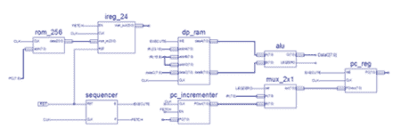

# 建造一台单指令计算机

> 原文：<https://hackaday.com/2011/07/27/building-a-one-instruction-computer/>

[Hasith]提交了这个项目,在那里他经历了用 Verilog 设计一个单指令 CPU 的过程。它可能不会赢得 Hack A Day 最酷版本的竞赛，但我们真的很欣赏这个版本的“应用书呆子”的一面。

只有一条指令，一个 [OISC](http://en.wikipedia.org/wiki/One_instruction_set_computer#Instruction_types) 比[我们今天要处理的烂摊子](http://en.wikipedia.org/wiki/X86_instruction_listings)简单多了。有一些指令本身是图灵完全的(比如*减法和负转移*，以及*移动*)。用这些指令中的一条设计 OISC 意味着它也能模拟图灵机。

[Hasith]的构建日志贯穿了构建全功能计算机的整个过程 ALU、程序计数器、指令寄存器和 ram。如果您想亲自尝试一下，甚至还有 Verilog 代码。

这不是我们第一次读到单指令集计算机。几年前，我们看到了一种硬件版本的减法和分支 if 负计算机。[Hasith]计划发布另一篇关于如何为他的 OISC 编写一个小编译器的操作指南。[Hasith]看起来是一个很酷的家伙，所以我们希望它不是一个[脑残](http://www.muppetlabs.com/~breadbox/bf/)编译器；我们不想让他染上酗酒的习惯。