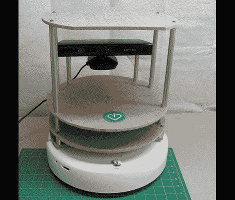

# 不使用机械工厂制造机器人

> 原文：<https://hackaday.com/2011/06/24/building-a-robot-without-using-a-machine-shop/>

我们通常避免为一个项目购买新工具。从长远来看，我们肯定会再次使用它们，但有时即使有这样的前景，你也负担不起。一个恰当的例子是我们一生渴望得到一台激光切割机；我们无法证明前期成本的合理性，但如果我们有前期成本的话，我们肯定会经常使用它。

如果你真的发现自己对一个需要激光切割零件的项目感兴趣，[I Heart Robotics]将向你展示如何用一些简单的手工工具来做这件事。上面看到的机器人是他们的乌龟机器人。你可以使用激光切割机切割自己的零件，你可以从他们那里购买一套工具，或者你可以拿出一把尺子、指南针、钻头、顶锯、打印机和胶带来手工制作零件。

这是一个足够简单的概念。把模板打印出来，贴在你的硬板上，然后开始钻孔和锯切。你不会得到机床所能达到的精度，但在某些情况下，你不需要那么完美。

[via Adafruit]