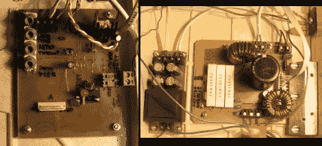

# 为三相电机构建变频驱动器

> 原文：<https://hackaday.com/2012/01/19/building-a-variable-frequency-drive-for-a-three-phase-motor/>

这里是[Miceuz] [设计用来控制三相感应电机](http://blog.hardcore.lt/mic/archives/011040.html)的电源和驱动板。这是他第一次搭建这样的系统，一路上他学到了很多东西。他承认这不是一个工业质量的驱动器，但它将适用于需要 200 瓦或更少功率的电机。

电机控制板使用 MC3PHAC 驱动器 IC，IRAMS06UP60A 处理电源方面的事情。大部分电路板设计来自对这两个器件的推荐应用原理图的研究。但这还远远不是设置的全部。电机驱动器总是包括保护级别(这是首先要有一个驱动器的全部原因)，并且有几种不同的形式。[Miceuz]确保添加 EMI、过压和过流保护。他讨论了所有这些，分享了解释每个概念的链接。