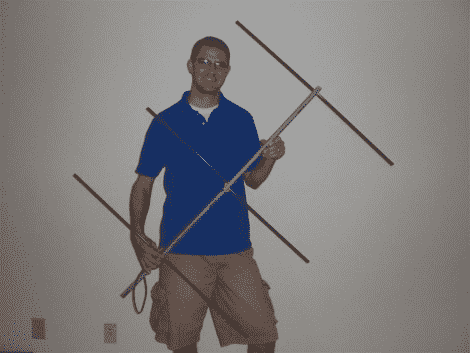

# 建造八木宇田天线

> 原文：<https://hackaday.com/2010/08/13/building-a-yagi-uda-antenna/>

[汤米·戈伯] [建造了这个八木宇田天线](http://neodux.com/?view=story.php&post_id=451)，它有一些方便的设计特点。吊杆是一根导管，在适当的位置钻有孔。元素是铝箭杆；这是一个很好的选择，因为它们是直的，相对便宜，并且一端有#8-32 螺纹。他用一些螺纹杆来连接反射器和导向器元件的两侧。从动元件偏置安装，以便每个元件的不同机器螺钉可以连接到同轴电缆的适当导体。[驻波比](http://neodux.com/?view=story.php&post_id=451)正好在它应该在的地方，这意味着他可以毫无困难地接收那些经过的卫星以及国际空间站。