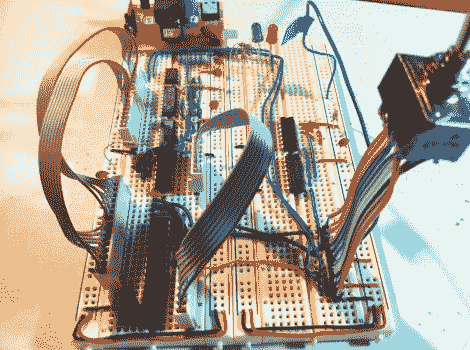

# 构建 EEPROM 编程器

> 原文：<https://hackaday.com/2012/01/11/building-an-eeprom-programmer/>

看看这个基于 85 的 EEPROM 编程器。这看起来像是一种迂回的做事方式，但是[Quinn Dunki]想要使用她手头的工具按照她的规格来建造。她想出的是一个 ATtinyISP USB 编程器，将数据推送到 ATtiny85，然后 attin y85 用所述数据对 EEPROM 芯片进行编程。

硬件是她 Veronica 6502 计算机构建的下一个模块。[当我们最后一次看到项目](http://hackaday.com/2012/01/04/backplane-and-mainboard-for-a-6502-computer/) [Quinn]计划为操作固件添加永久存储时。这将是用该器件编程的 EEPROM 的形式。使用 ISP 和 ATtiny 作为中间人意味着她在不移除芯片的情况下刷新操作系统应该没有问题。但这一切都取决于她如何设计界面。

例如，她浪费了大量时间来排除设备故障，因为垃圾数据被写入芯片。最终，她的手动总线编程器在闪存操作期间被挂掉是罪魁祸首。经验教训，这是向前和向上的建设。

我们最近一直在报道[奎因的]项目。这部分是因为它们真的很有趣，但也因为她在记录自己的经历方面做得非常好。