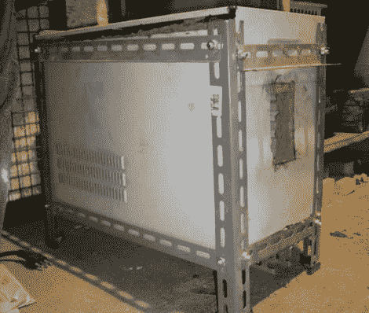

# 建造一座电窑

> 原文：<https://hackaday.com/2011/04/13/building-an-electric-kiln/>

[EmcySquare]正在钻研一些业余爱好——打造自己的刀具。他需要一个熔炉来加热金属，在尝试了几种不同的锻造设计后，他决定尝试建造一个电炉。上面看到的最后一个项目是一个盒子里的盒子。外壳是用旧电脑机箱和金属搁板托架回收的。在里面，你会发现一个由耐火砖制成的盒子，带有石棉隔热层，以保持热量在它应该在的地方。

他将砖块切割成合适的尺寸来建造内盒，然后在内侧边缘添加凹槽来放置加热线圈。这种切割是用角磨机完成的，[EmcySquare]指出，它会扬起大量的砖块灰尘，以确保你戴上了呼吸器和护目镜。一旦外壳准备好了，他就开始制造加热线圈。使用了 12 米长的 [Kanthal A1 钢丝](http://www.kanthal.com/products/material-datasheets/wire/resistance-heating-wire-and-resistance-wire/kanthal-a-1/)，通过在直径为 1 厘米的木钉周围形成线圈，将其缩短至整齐的长度。这个原型可以工作，但未来的改进计划通过热电偶和继电器增加自动温度控制。